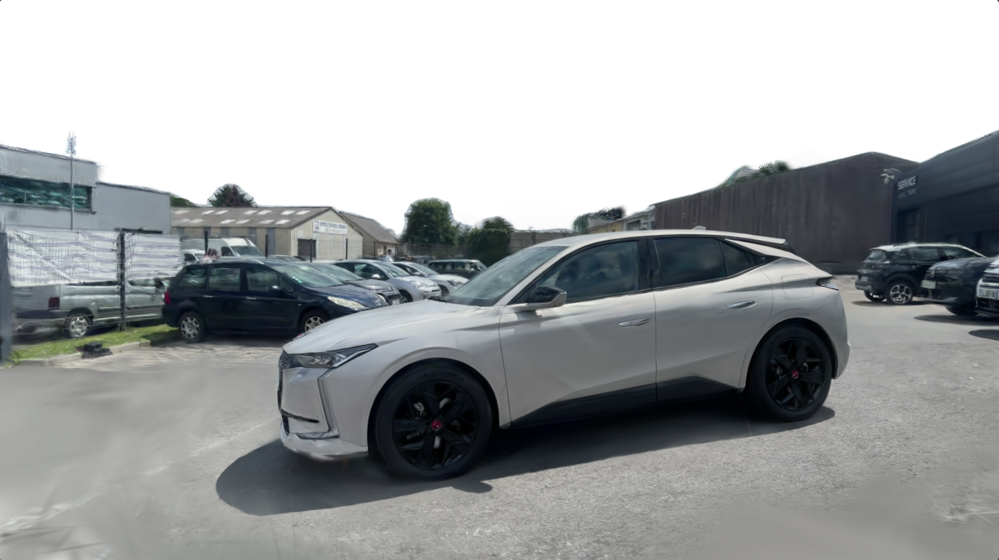

# SkyMask — Prompted sky masking + top padding for cleaner 3DGS

A command-line tool to generate high-quality masks from multi-view images using **Grounded DINO** + **SAM 2**, automatically remove the sky (or any prompted class), and add transparent **top padding** to reduce noisy Gaussians during 3D Gaussian Splatting (3DGS) reconstruction.

<p align="center">
  
  
</p>

---

## Why this exists

Sky regions often introduce floating / unstable splats in 3DGS. This tool:

- Detects a target class (default **“sky”**) via Grounded-DINO boxes and SAM-2 segmentation.
- Inverts the mask to keep non-sky pixels opaque and make sky fully transparent.
- Adds **50 px** transparent padding to the **top border** to help downstream reconstruction.

---

## Features

- **Prompted masking:** choose any text prompt (e.g., “sky”, “ceiling”, “car”). Box & text thresholds are configurable.
- **SAM-2 segmentation:** fast, high-quality masks from Grounded-DINO proposals (requires model checkpoint + config; see Setup).
- **Top padding:** outputs 4-channel **RGBA** PNGs with an extra transparent band at the top to stabilize training near image borders.
- **Simple CLI:** `skymask process-masks -d /path/to/images -p sky -bt 0.5 -tt 0.25`.

---

## 💾 Installation

### 1. Create & activate the Conda environment
```bash
conda create -n skymask python
conda activate skymask
```
### 2. Install dependencies

```bash
# Change directories to project root (skyMask/):
cd <project-dir: skyMask>

# Install SAM2, & CLIP
# This will also install a CUDA-enabled version of PyTorch (based on pip defaults)
pip install -r requirements.txt

# Install ffmpeg binary in the same env
conda install ffmpeg -c conda-forge

# Install the skyMask package and its CLI entrypoints:
pip install .
```

### 3. Download SAM2 weights for semantic masks
```bash
cd ..  # Return to project root
mkdir -p models
wget https://dl.fbaipublicfiles.com/segment_anything_2/092824/sam2.1_hiera_large.pt -P models
```

--

## 🚀 Execution

From your project root

```bash
skyMask process-masks --data-dir <path/to/images>
```

- Outputs are saved to ../masks/ relative to your --data-dir (one mask_XXXXX.png per input).

## CLI options
```bash
skyMask process-masks
  --data-dir, -d        Path to images directory (required)
  --prompt, -p          Detection prompt (default: "sky")
  --box-threshold, -bt  Bounding box score threshold (e.g., 0.5)
  --text-threshold, -tt Text matching threshold (e.g., 0.25)
  --inspect, -i         Show a preview every 10 images (True/False)
```
- Box/text thresholds control Grounded-DINO proposal quality & label matching. Tune per scene.

- Inspect shows side-by-side original vs. mask to sanity-check batches.

# How it works (under the hood)

1. Prompt → boxes: Grounded-DINO proposes bounding boxes for your prompt. Thresholds gate proposals.

2. Boxes → mask: SAM-2 predicts masks; the best-scoring mask per box is selected.

3. Invert & alpha: The sky region is made fully transparent; everything else remains opaque.

4. Top padding: A 50-pixel transparent band is added to the top before writing RGBA PNGs.

<p align="center">
  
  <em>SkyMask pipeline (green) vs. baselines </em>
</p>

## Tips for 3DGS pipelines

Use RGBA outputs to ignore transparent pixels in training where supported, or convert to separate binary masks as needed.

If detection under-fills the sky, lower -bt/-tt. If it leaks into structures, raise them.
